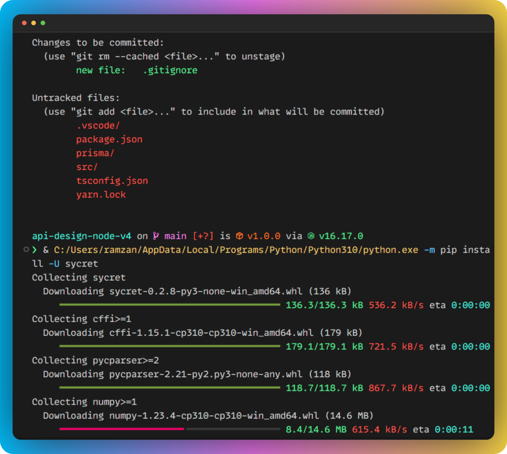

# **Vibrant Dark Plus**

  

Vibrant Dark Plus is an extension of Dark+ default theme with more vibrant colors and customizations of various elements. You'll find some subtle difference but the overall default scheme is kept intact.

# **Samples**
## **JSX**

## **Typescript** 

## **Python**

## **Terminal**

## **CSS**

### **Font used**:  `MonoLisa`

### **ZoomLevel**: `1`